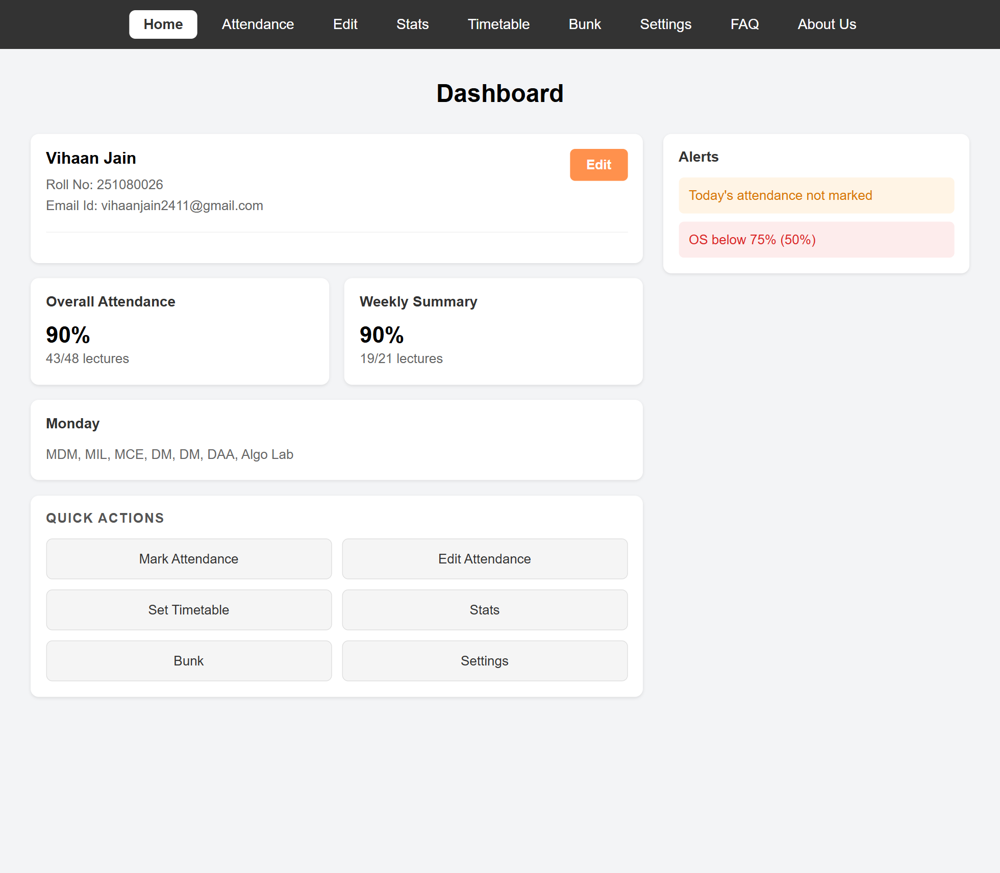
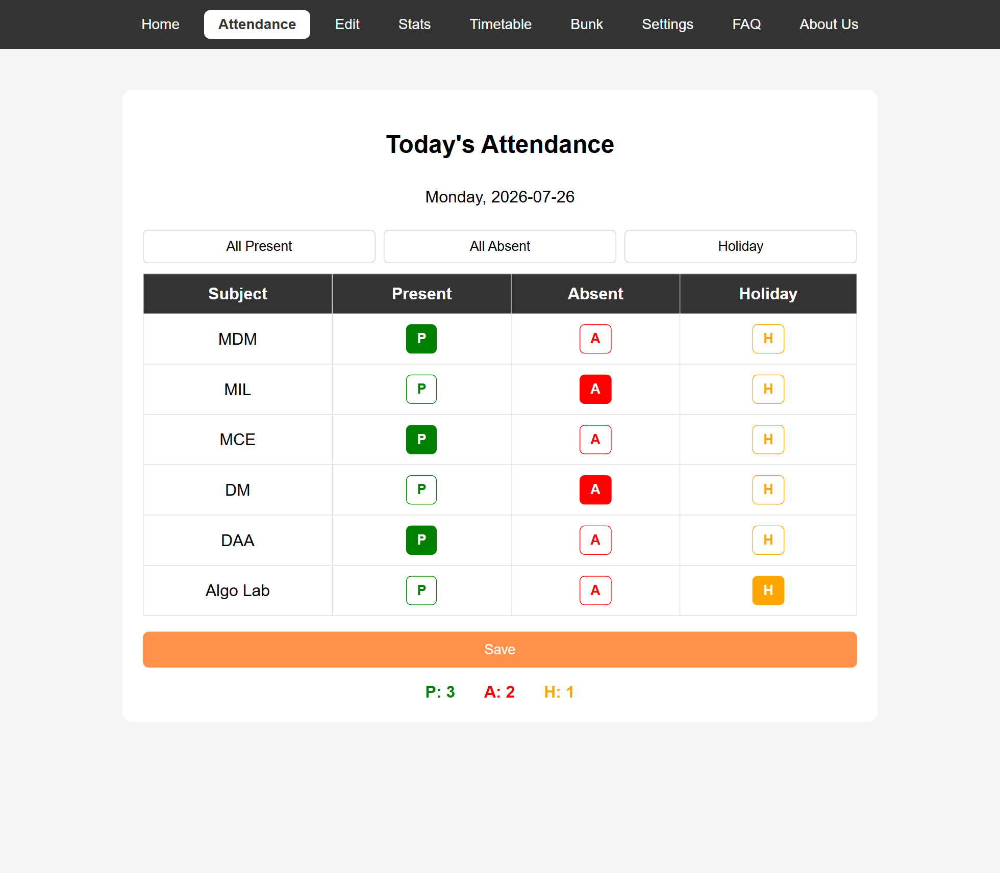
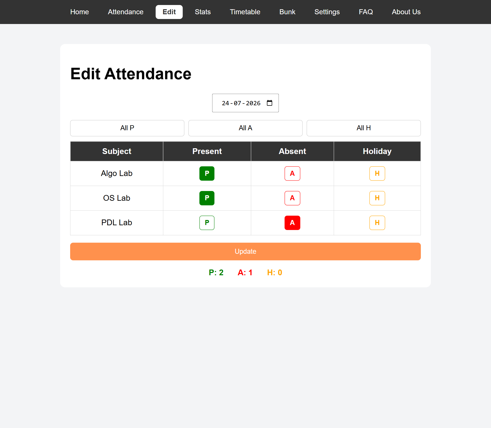
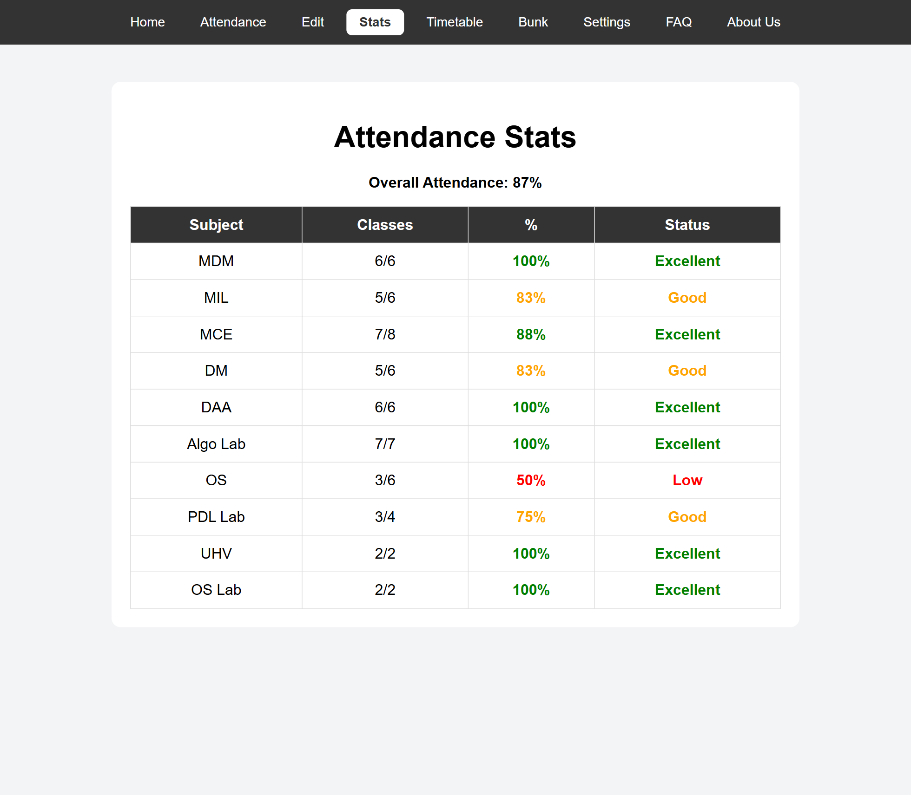
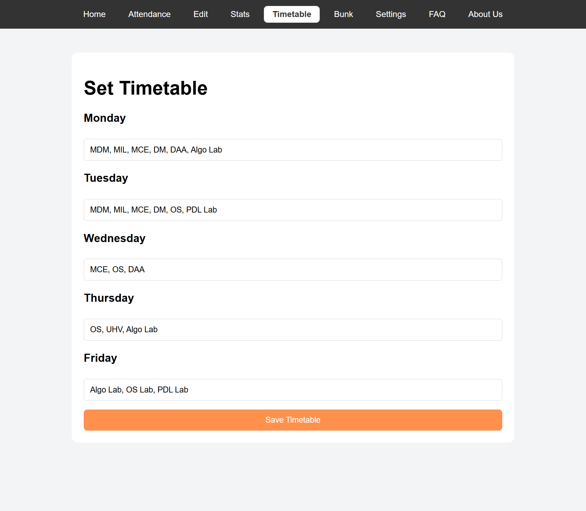
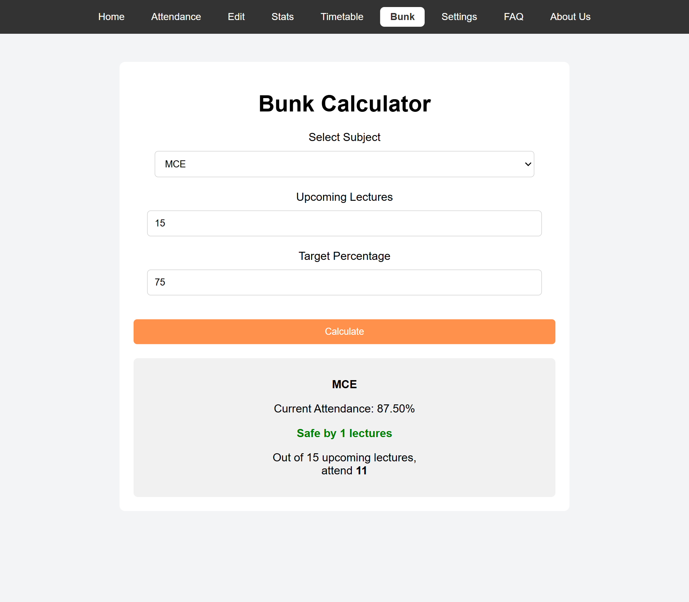
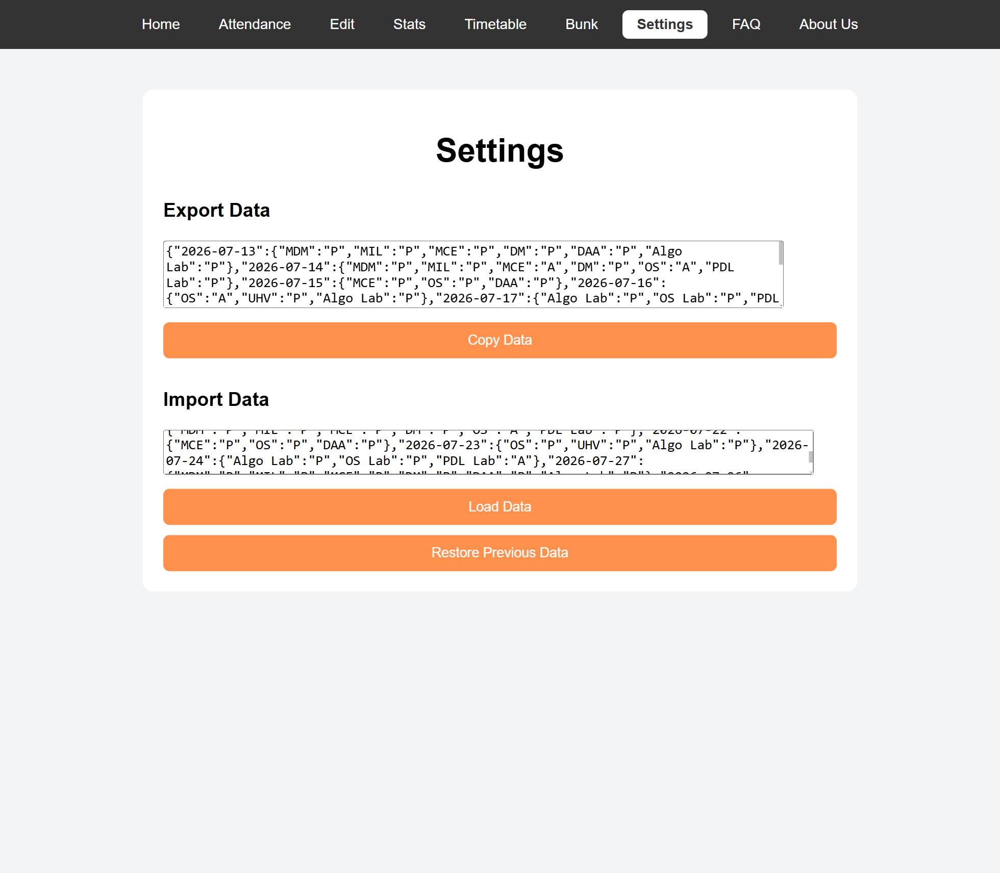

# 📚 Attendance Tracker

> **A lightweight attendance management system that helps students track lectures, monitor attendance, analyze subject-wise statistics, plan safe bunks, and manage weekly timetables — all directly in the browser.**

<p align="center">

[🌐 Live Demo](https://v1haan24.github.io/Attendance-Tracker/) •
[📂 Repository](https://github.com/v1haan24/Attendance-Tracker)

</p>

---

## ✨ Features

- 📊 Interactive dashboard with attendance overview
- ✅ Daily attendance marking
- ✏️ Edit previously recorded attendance
- 📈 Subject-wise attendance analytics
- 📅 Weekly timetable management
- 🧮 Smart bunk calculator
- 👤 User profile management
- ⚠️ Automatic low-attendance alerts
- 💾 Import / Export attendance data
- 💻 Browser-based persistence using LocalStorage
- ❓ Built-in FAQ page

---

# 📸 Preview

<p align="center">
  
</p>

<p align="center">
<b>Dashboard Overview</b>
</p>

<details>

<summary><b>📷 View All Screenshots</b></summary>

<br>

### Attendance

<p align="center">

</p>

---

### Edit Attendance

<p align="center">

</p>

---

### Statistics

<p align="center">

</p>

---

### Timetable

<p align="center">

</p>

---

### Bunk Calculator

<p align="center">

</p>

---

### Settings

<p align="center">

</p>

</details>

---

# 🚀 Live Demo

Try the application here:

**👉 https://v1haan24.github.io/Attendance-Tracker/**

---

# 🛠 Tech Stack

- HTML5
- CSS3
- JavaScript (ES6)
- Browser LocalStorage

---

# 📂 Project Structure

```text
Attendance-Tracker/
│
├── assets/
├── css/
├── js/
├── pages/
├── index.html
└── README.md
```

---

# 🌟 Main Modules

### 🏠 Dashboard

- Overall attendance percentage
- Weekly attendance summary
- Today's lectures
- Attendance alerts
- Quick action shortcuts

### ✅ Attendance

- Mark lectures as Present, Absent, or Holiday
- One-click "All Present"
- One-click "All Absent"

### ✏️ Edit Attendance

- Update attendance for previous dates
- Automatically refresh statistics

### 📊 Statistics

- Subject-wise attendance percentages
- Overall attendance summary
- Attendance status indicators

### 📅 Timetable

- Configure weekly lecture schedules
- Automatically display today's timetable

### 🧮 Bunk Calculator

- Calculate safe bunks
- Plan future attendance based on a target percentage

### ⚙️ Settings

- Export attendance data
- Import saved data
- Restore previous backup

---

# 💾 Data Storage

The application stores data locally in the browser using **LocalStorage**.

Stored information includes:

- User Profile
- Attendance Records
- Weekly Timetable
- User Preferences

No backend or database is required.

---

# ▶️ Getting Started

Clone the repository

```bash
git clone https://github.com/v1haan24/Attendance-Tracker.git
```

Open

```text
index.html
```

in your preferred browser.

No installation or dependencies are required.

---

# 🔮 Future Improvements

- 🌙 Dark Mode
- 📱 Fully Responsive Design
- 📊 Interactive Charts
- ☁️ Cloud Synchronization
- 🔔 Attendance Notifications
- 📅 Calendar View
- 📈 Attendance Prediction
- 📦 Progressive Web App (PWA)

---

# 👨‍💻 Author

**Vihaan Jain**

If you found this project useful, consider ⭐ starring the repository.